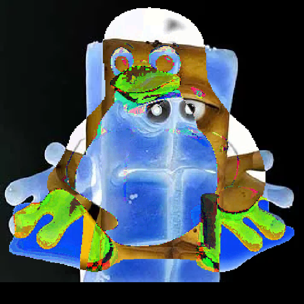

# **Image OTP Demonstration**

This project demonstrates **why One-Time Pads (OTPs) must never be reused**.  
Using images as an example, the program encrypts(pixel by pixel) PNG files using a generated OTP key and then XORs encrypted images pairwise to reveal how OTP reuse leaks information.

---

## **Overview**

### **1. Input Images**
Users place **any number of PNG images** into the `input/` folder.  
- Only the **RGB values** of pixels are encrypted.  
- **Alpha values turns opaque**.  

---

### **2. OTP Encryption**
For each image:
1. A **random OTP key** is generated that matches the size of the image.  
2. The program encrypts the image **pixel-by-pixel** using XOR.  
3. The encrypted image is saved to the `enc/` folder.  
4. The OTP key itself is kept internally (not saved).  

This produces perfectly secure ciphertext *only if the OTP is not reused*.

---

### **3. Pairwise XOR Attack Demonstration**
To show the consequences of OTP reuse, the program:
1. Takes the encrypted images from `enc/`  
2. XORs **every possible image pair**  
3. Saves the results into the `out/` folder  

---

## **Original Images (600×600)**

| Original Image 1 | Original Image 2 | Original Image 3 |
|------------------|------------------|------------------|
|  |  |  |

---
## **Encrypted Images (Using the Same OTP)**

Although encryption with a One-Time Pad produces perfect secrecy *when used correctly*,  
reusing the same key causes all images to be encrypted with identical keystreams.

| Encrypted 1 | Encrypted 2 | Encrypted 3 |
|-------------|-------------|-------------|
|  |  |  |

*(They appear as random noise — nothing can be learned from these alone.)*

---

## **XORing Encrypted Images (The Critical Failure)**

Because the **same OTP was reused**, XORing the ciphertexts removes the key and exposes structure from the original images.

| Image1 ⊕ Image2 | Image1 ⊕ Image3 | Image2 ⊕ Image3 |
|------------------|------------------|------------------|
|  |  |  |

These outputs reveal edges, shapes, and visual patterns — demonstrating that OTP reuse completely destroys security.

---

## **Conclusion**
